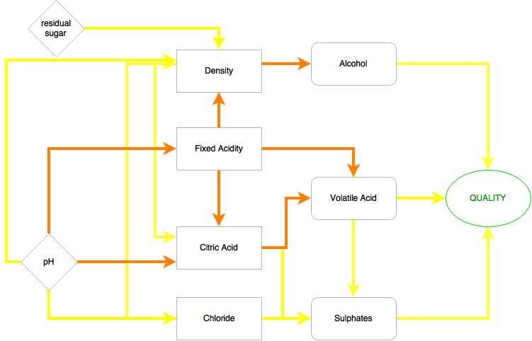

**Dataset**: a tidy data set from 2009 testing the chemical properties of Vinho Verde red wine. At least 3 wine experts rated the quality of each wine between 0 (very bad) and 10 (very excellent).  More information can be found [here.](https://s3.amazonaws.com/udacity-hosted-downloads/ud651/wineQualityInfo.txt).

**Question**: What variables contribute to making the best quality Red Wine?


```{r intro, echo=FALSE}

setwd('/Users/bryonymiles/documents/udacityprojects')
rwine <-read.csv('wineQualityReds.csv')

```
#1. Initial Analysis: structure of the dataset.

Dimensions?
```{r dim, echo=FALSE}
dim(rwine)
```
Variables?
```{r vars, echo=FALSE}
names(rwine)
```
Field Descriptions:

1. **Fixed acidity**: most wine acids involved are fixed or nonvolatile (do not evaporate readily)
2. **Volatile acidity**: amount of acetic acid in wine - can be unpleasant, vinegary taste if too high? 
3. **Citric acid**: found in small quantities, can add 'freshness' and flavor to wines
4. **Residual sugar**: sugar remaining after fermentation stops, rare < 1 gram/liter, > 45 grams/liter are considered sweet
5. **Chlorides**:  amount of salt in the wine
6. **Free sulfur dioxide**: the free form of SO2 - prevents microbial growth and the oxidation of wine
7. **Total sulfur dioxide**: free + bound forms of S02; in low concentrations, mostly undetectable in wine, free SO2 over 50 ppm, evident in the nose and taste of wine
8. **Density**: the density of water is close to that of water (approx 1) depending on the percent alcohol and sugar content
9. **pH**: acidic  on a scale from 0 (very acidic) to 14 (very basic); most wines are between 3-4 on the pH scale
10. **Sulphates**: anadditive which can contribute to S02 levels,  acts as an antimicrobial and antioxidant.  
11.**Alcohol**: the percent alcohol content of the wine
12. **Quality (Output Variable)** - sensory score between 0 and 10

Structure?
```{r str, echo=FALSE}
str(rwine)
```
Descriptive Stats?
```{r desc, echo=FALSE}
summary(rwine)
```

Thoughts at this stage - Quality range is between 3 and 8 - does this correlate with anything?

Mean/Median seem to be relatively close on all variables except total.sulfur.dioxide and chlorides - long tailed?

#2. Data Transformation (Univariate analysis)

Next step to look at the distribution of each individual variable and how a log10 or sqrt transformation might affect this.
  
1. **Fixed acidity**:  Remove outliers
  
Transformations have an effect but once 8 outliers are removed (> 14) the distribution is quite normal.  I also checked the outliers in case there were any significant results.  As the quality is all between 5 and 7 where the majority of the results fall this is fine.

```{r fixedacid, echo=FALSE, message=FALSE, warning=FALSE}

library(ggplot2)
library(gridExtra)
p1 <- qplot(data = rwine, bins=20, x = fixed.acidity,fill = I('blue'),xlab = 'Fixed Acidity Histogram') 
p2 <- qplot(data = rwine, bins=20, x = fixed.acidity,fill = I('blue'),xlab = 'Fixed Acidity Log 10 Histogram') + scale_x_log10() 
p3 <- qplot(data = rwine, bins=20, x = fixed.acidity,fill = I('blue'),xlab = 'Fixed Acidity Sqrt Histogram') + scale_x_sqrt() 
grid.arrange(p1,p2,p3)
```
  
Quality Table: acidity > 14  
```{r fixedacid2, echo=FALSE,message=FALSE,warning=FALSE}
table(rwine$quality,rwine$fixed.acidity>14)
qplot(data = rwine, bins=20, x = fixed.acidity,fill = I('orange'),xlab = 'Fixed Acidity Histogram - Outliers removed')  + xlim(0, 14)
```
  
2. **Volatile acidity**: removed outliers
  
As with fixed acidity.  The best option seemed to be to remove 4 outliers (>1.2)  

```{r volacid, echo=FALSE, messages=FALSE, warning=FALSE}

p4 <- qplot(data = rwine, bins=20, x = volatile.acidity,fill = I('blue'),xlab = 'Volatile Acidity Histogram')
p5 <- qplot(data = rwine, bins=20, x = volatile.acidity,fill = I('blue'),xlab = 'Volatile Acidity Log 10 Histogram') + scale_x_log10() 
p6 <- qplot(data = rwine, bins=20, x = volatile.acidity,fill = I('blue'),xlab = 'Volatile Acidity Sqrt Histogram') + scale_x_sqrt()

grid.arrange(p4,p5,p6)
```
  
Quality Table: volatile acidity > 1.2  
```{r volacid2, echo=FALSE,message=FALSE,warning=FALSE}

table(rwine$quality,rwine$volatile.acidity>1.2)

qplot(data = rwine, bins=20, x = volatile.acidity,fill = I('orange'),xlab = 'Volatile Acidity Histogram - Outliers removed') + xlim(0, 1.2)

```
  
3. **Citric acid**  
  
There are 132 0 values which seem to be pretty evenly distributed on quality so neither of the transformations are suitable.  The best I can do here is remove 6 outliers which spreads the distribution out a bit.  

```{r citacid, echo=FALSE, messages=FALSE, warning=FALSE}

p7 <- qplot(data = rwine, bins=20, x = citric.acid,fill = I('blue'),xlab = 'Citric Acid Histogram')
p8 <- qplot(data = rwine, bins=20, x = citric.acid,fill = I('blue'),xlab = 'Citric Acid Log 10 Histogram') + scale_x_log10() 
p9 <- qplot(data = rwine, bins=20, x = citric.acid,fill = I('blue'),xlab = 'Citric Acid Sqrt Histogram') + scale_x_sqrt()
grid.arrange(p7,p8,p9)
```
  
Quality Table: citric acid == 0  
```{r citacid2, echo=FALSE, messages=FALSE, warning=FALSE}
table(rwine$quality,rwine$citric.acid==0)
```
  
Quality Table: citric acid > 0.75  
```{r citacid3, echo=FALSE, messages=FALSE, warning=FALSE}
table(rwine$quality,rwine$citric.acid>0.75)

qplot(data = rwine, bins=20, x = citric.acid,fill = I('orange'),xlab = 'Citric Acid Histogram - Outliers removed')  + xlim(0,0.75)
```
  
4. **Residual sugar** 
This time I went for a log transformation.
Removing outliers >6 (see graph) did had a significant impact on the distribution but there were 46 records which I felt was too many.  
  
```{r ressugar, echo=FALSE, messages=FALSE, warning=FALSE}

p10 <- qplot(data = rwine, bins=20, x = residual.sugar,fill = I('blue'),xlab = 'Residual Sugar Histogram')
p11 <- qplot(data = rwine, bins=20, x = residual.sugar,fill = I('blue'),xlab = 'Residual Sugar Log 10 Histogram') + scale_x_log10() 
p12 <- qplot(data = rwine, bins=20, x = residual.sugar,fill = I('blue'),xlab = 'Residual Sugar Sqrt Histogram') + scale_x_sqrt()
grid.arrange(p10,p11,p12)
```
  
Quality Table: residual sugar > 6  
```{r ressug3, echo=FALSE, messages=FALSE, warning=FALSE}
table(rwine$quality,rwine$residual.sugar>6)
```
Outliers over 6 looks evenly spread.  
```{r ressugar2, echo=FALSE, messages=FALSE, warning=FALSE}
qplot(data = rwine, bins=20, x = residual.sugar,fill = I('orange'),xlab = 'Residual Sugar Histogram - Outliers removed') + xlim(0,6)
```
  
5. **Chlorides**: 
For chlorides I went for a Log 10 transformation as it produced a central relatively evenly spread curve.

```{r chlor, echo=FALSE, messages=FALSE, warning=FALSE}
p13 <- qplot(data = rwine, bins=20, x = chlorides,fill = I('blue'),xlab = 'Chlorides Histogram')
p14 <- qplot(data = rwine, bins=20, x = chlorides,fill = I('blue'),xlab = 'Chlorides Log 10 Histogram') + scale_x_log10() 
p15 <- qplot(data = rwine, bins=20, x = chlorides,fill = I('blue'),xlab = 'Chlorides Sqrt Histogram') + scale_x_sqrt()
grid.arrange(p13,p14,p15)
```
  
Quality Table: chlorides > 0.25  
```{r chlo3, echo=FALSE, messages=FALSE, warning=FALSE}
table(rwine$quality,rwine$chlorides>0.25)
qplot(data = rwine, bins=20, x = chlorides,fill = I('orange'),xlab = 'Chlorides Histogram - Outliers removed') + xlim(0,0.25)
```

6. **Free sulfur dioxide**  
Sqrt transformation - this normalises better than log 10.  Removing 4 outliers doesn't alter the distribution significantly.

```{r freeso2, echo=FALSE, messages=FALSE, warning=FALSE}
p16 <- qplot(data = rwine, bins=20, x = free.sulfur.dioxide,fill = I('blue'),xlab = 'Free SO2 Histogram')
p17 <- qplot(data = rwine, bins=20, x = free.sulfur.dioxide,fill = I('blue'),xlab = 'Free SO2 Log 10 Histogram') + scale_x_log10() 
p18 <- qplot(data = rwine, bins=20, x = free.sulfur.dioxide,fill = I('blue'),xlab = 'Free SO2 Sqrt Histogram') + scale_x_sqrt()
grid.arrange(p16,p17,p18)
```
  
Quality Table: free sulfur dioxide > 60  
```{r fso23, echo=FALSE, messages=FALSE, warning=FALSE}
table(rwine$quality,rwine$free.sulfur.dioxide>60)
qplot(data = rwine, bins=20, x = free.sulfur.dioxide,fill = I('orange'),xlab = 'Free SO2 Histogram - Outliers removed') + xlim(0,60)
```
  
7. **Total sulfur dioxide**  
  
For total SO2 I chose to remove 3 outliers (>160).  The distribution is still heavily positively skewed but neither transformation option seems to have a significant effect.   The 3 outliers were quite high in quality so I double checked the mean for all data > 150 in case this was a significant trend.

```{r totalso2, echo=FALSE, messages=FALSE, warning=FALSE}
p19 <- qplot(data = rwine, bins=20, x = total.sulfur.dioxide,fill = I('blue'),xlab = 'Total SO2 Histogram')
p20 <- qplot(data = rwine, bins=20, x = total.sulfur.dioxide,fill = I('blue'),xlab = 'Total SO2 Log 10 Histogram') + scale_x_log10() 
p21 <- qplot(data = rwine, bins=20, x = total.sulfur.dioxide,fill = I('blue'),xlab = 'Total SO2 Sqrt Histogram') + scale_x_sqrt()
grid.arrange(p19,p20,p21)
```
  
Quality Table: total sulfur dioxide > 160  
```{r tso2tab, echo=FALSE, messages=FALSE, warning=FALSE}
table(rwine$quality,rwine$total.sulfur.dioxide>160)
newwine = subset(rwine,rwine$total.sulfur.dioxide>150)
```
Double checking means (new then old).
```{r totalso22, echo=FALSE, messages=FALSE, warning=FALSE}
mean(newwine$quality)
mean(rwine$quality)
qplot(data = rwine, bins=20, x = total.sulfur.dioxide,fill = I('orange'),xlab = 'Total SO2 Histogram - Outliers removed') + xlim(0,160)
```
  
8. **Density**: 
No change - normal already  
```{r density, echo=FALSE, messages=FALSE, warning=FALSE}
qplot(data = rwine, bins=20, x = density,fill = I('blue'),xlab = 'Density Histogram') 
```
  
9. **pH**:  no change - normal already 
  
```{r ph, echo=FALSE, messages=FALSE, warning=FALSE}
qplot(data = rwine, bins=20, x = pH,fill = I('blue'),xlab = 'pH Histogram') 
```

10. **Sulphates**: 
I decided on log10 transformation.  The outliers have  low quality values (all under 6) which may be signficant.   
```{r sulphates, echo=FALSE, messages=FALSE, warning=FALSE}


p22 <- qplot(data = rwine, bins=20, x = sulphates,fill = I('blue'),xlab = 'Sulphates Histogram')
p23 <- qplot(data = rwine, bins=20, x = sulphates,fill = I('blue'),xlab = 'Sulphates Log 10 Histogram') + scale_x_log10() 
p24 <- qplot(data = rwine, bins=20, x = sulphates,fill = I('blue'),xlab = 'Sulphates Sqrt Histogram') + scale_x_sqrt()
grid.arrange(p22,p23,p24)
```
  
Quality Table: sulphates > 1.5  
```{r sulptab, echo=FALSE, messages=FALSE, warning=FALSE}
table(rwine$quality,rwine$sulphates>1.5)
```
11. **Alcohol**: 

No change - transformations have no significant impact, neither does removing the outliers.

```{r alco, echo=FALSE, messages=FALSE, warning=FALSE}

p22 <- qplot(data = rwine, bins=20, x = alcohol,fill = I('blue'),xlab = 'Alcohol Histogram')
p23 <- qplot(data = rwine, bins=20, x = alcohol,fill = I('blue'),xlab = 'Alcohol Log 10 Histogram') + scale_x_log10() 
p24 <- qplot(data = rwine, bins=20, x = alcohol,fill = I('blue'),xlab = 'Alcohol Sqrt Histogram') + scale_x_sqrt()
grid.arrange(p22,p23,p24)
```
  
Quality Table: alcohol > 14  
```{r alcotab, echo=FALSE, messages=FALSE, warning=FALSE}
table(rwine$quality,rwine$alcohol>14)
qplot(data = rwine, bins=20, x = alcohol,fill = I('orange'),xlab = 'Alcohol Histogram - Outlier removed') + xlim(0,14)
```

12. **Quality** (Output Variable) - sensory score between 0 and 10.  Not sensible to change it.
  
```{r gg2, echo=FALSE, echo=FALSE, messages=FALSE, warning=FALSE}
newrwine = subset(rwine,fixed.acidity<=14 & volatile.acidity<=1.2 & citric.acid<=0.75 & total.sulfur.dioxide<=160)
newrwine = data.frame(newrwine$X,
  newrwine$fixed.acidity,
  newrwine$volatile.acidity, 
  newrwine$citric.acid,
  log10(newrwine$residual.sugar),
  log10(newrwine$chlorides),
  sqrt(newrwine$free.sulfur.dioxide),
  newrwine$total.sulfur.dioxide,
  newrwine$density,
  newrwine$pH,
  log10(newrwine$sulphates),
  newrwine$alcohol,
  newrwine$quality)
```
The combined outlier removal resulted in 20 less rows:
```{r unires, echo=FALSE, messages=FALSE, warning=FALSE}
dim(newrwine)
rwine = subset(rwine,fixed.acidity<=14 & volatile.acidity<=1.2 & citric.acid<=0.75 & total.sulfur.dioxide<=160)

#code commented out because I have annoted the exported pdf instead
#library(GGally)
#ggpairs(newrwine)
```
  
#3. GG Pairs (Bivariate Analysis)

Below is the ggpairs for the transformed data.  I've colour coded the Pearson's R results as follows:

<span style="color:#CCCC00">yellow</span>  (0.3-0.5 small meaning)
<span style="color:orange">orange</span>  (0.5-0.7 moderate)
<span style="color:red">red</span>     (0.7+ pretty large)  
  
The corresponding plots are highighted in green.


What does this mean though?  

I ended up plotting it on a flow diagram using draw.io.  Colour coding applies to the arrows.


  
Conclusions:

1. Although Free and Total SO2 are highly correlated, they do not correlate with any other variables so I am not going to analyse them further.  

2. Residual sugar seems to have a small correlation to density but nothing else.  This may be due to the fact that vinho verde red wine isn't intended to be sweet.  I won't analyse that further either.  
  
3. Start off with **3 critical factors** - Alcohol, Volatile Acid and Sulphates.  
  
4. Link these critical factors to related variables and see if I can see any further patterns.  

#4. Quick look at Quality
  
There majority of the data has quality level 5,6,7.  

```{r qual, echo=FALSE}
qplot(x=quality,data=rwine,binwidth=1,bins=6,fill=I('blue'))
```

#5. Critical Factor Analysis (Multivariate Analysis)

##1. ALCOHOL  
  
Some stats first:  
```{r alc, echo=FALSE,message=FALSE,warning=FALSE}
library(dplyr)
q_groups <- group_by(rwine,quality)
rwine.alc_by_q <- summarise(q_groups, 
                            alcohol_mean = mean(alcohol),
                            alcohol_median = median(alcohol),
                            n = n())
rwine.alc_by_q
```
Percent with quality 5,6,7 = `r (681+638+199)/1599`
```{r qual3,echo=FALSE}
ggplot(rwine, aes(x=alcohol)) + geom_histogram(binwidth=0.5,fill='blue',bins=7) + facet_grid(~quality)
```
  
Initial Analysis:

95% of the data is in the quality bracket 5-7
The alcohol content goes up in line with the quality.  Nothing <10 for top quality, nothing over 12 for lower
The majority of mid range wines (5 & 6) = 10

In more detail..  
  
```{r alc2, echo=FALSE}
ggplot(aes(y=alcohol,x=quality),data = rwine) + 
  geom_point(alpha = 1/5, position = position_jitter(h = 0))  + 
  geom_line(stat = 'summary', fun.y = mean, linetype = 2, color = 'red') +
  geom_line(stat = 'summary', fun.y = quantile, fun.args = list(probs = .1)) +
  geom_line(stat = 'summary',fun.y= quantile, fun.args = list(probs = .9)) 
```
  
Once the quality gets to 5 there is a clear positive trend.  
  
What about **density**?, **fixed acidity**, **chlorides**, **citric acid** and **pH**?  
How do they affect the alcohol level.  
What makes it high?  

I started with **density**.  The density of the wine is known to be linked to the alcohol content so this correlation is not a surprise.  
  
```{r alc3, echo=FALSE}
ggplot(aes(x=alcohol,y=density,color=quality),data = rwine) + 
  geom_point(alpha = 1/5, position = position_jitter(h = 0))  + 
  scale_colour_gradient(low = I('yellow'), high = I('purple'), na.value = "grey50", guide = "colourbar") + 
  stat_smooth(method = lm)
```
  
There seems to be a negative linear correlation between alcohol and density - the content is higher when the density is lower.
  
How about **fixed acidity** and **density**?
  
```{r alc11, echo=FALSE}
ggplot(aes(x=density,y=fixed.acidity,color=quality),data = rwine) + 
  geom_point(alpha = 1/5, position = position_jitter(h = 0)) +
  scale_colour_gradient(low = I('yellow'), high = I('purple'), na.value = "grey50", guide = "colourbar") + 
  stat_smooth(method = lm)
```
  
There seems to be a positive linear correlation here.  The higher the density, the higher the fixed acidity.  

How about **chlorides** and **density**?
  
```{r alc4, echo=FALSE,message=FALSE,warning=FALSE}

ggplot(aes(x=density,y=chlorides,color=quality),data = rwine) + 
  geom_point(alpha = 1/5, position = position_jitter(h = 0)) +
  scale_colour_gradient(low = I('yellow'), high = I('purple'), na.value = "grey50", guide = "colourbar") + scale_y_log10() +
  stat_smooth(method = lm) + ylab('log10 chlorides')

```
  
Slight positive trend here but high distribution of quality.  It seems more of a cluster that a trend and the quality is dispersed - dead end?

How about **citric acid** and **density**?
  
```{r alc6, echo=FALSE}

ggplot(aes(x=density,y=citric.acid,color=quality),data = rwine) + 
  geom_point(alpha = 1/5, position = position_jitter(h = 0)) +
  scale_colour_gradient(low = I('yellow'), high = I('purple'), na.value = "grey50", guide = "colourbar") + 
  stat_smooth(method = lm)

```
  
The smoother is confusing here.  There is no clear linear regression.  However, the correlation between citric acid and quality looks quite strong. 

Citric acid is "found in small quantities and can add freshness and flavour to wines".  This could clearly have an impact on quality despite the fact that the quality ratings for 0 values are well distributed.  

To double check, lets see what happens when we remove the 0 values.

```{r alc7, echo=FALSE, message=FALSE,warning=FALSE}

ggplot(aes(x=quality,y=citric.acid),data = rwine) + 
  geom_jitter(alpha=0.5) + ylim(0.1,1)

```
  
Pearsons'R on quality is  
  
```{r citR, echo=FALSE}
rwine2 = subset(rwine,rwine$citric.acid>0.1)
cor(rwine2$quality, rwine2$citric.acid)
```
This is not wildly significant.  Adding this to the fact that the data we removed did not show a trend of low quality data I'd say this is a dead end as well.

And lastly **pH**?
  
```{r alc9, echo=FALSE,message=FALSE,warning=FALSE}
ggplot(aes(x=fixed.acidity,y=pH,color=quality),data = rwine) + 
  geom_point(alpha = 1/5, position = position_jitter(h = 0)) +  
  scale_colour_gradient(low = I('yellow'), high = I('purple'), na.value = "grey50", guide = "colourbar") + 
  stat_smooth(method = lm)
```
  
Looks like a strong negative trend here...  
```{r alc10, echo=FALSE,message=FALSE,warning=FALSE}
ggplot(aes(x=fixed.acidity,y=density,color=pH),data = rwine) + 
  geom_point(alpha = 1/5, position = position_jitter(h = 0)) + xlim(7,15) + 
  scale_colour_gradient(low = I('blue'), high = I('red'), na.value = "grey50", guide = "colourbar") + 
  stat_smooth(method = lm)
```

But does pH figure?  Tricky to tell.  The Ph levels do seem higher at the 'positive' end? 

**Possible hypothesis**:  
  
low density levels + low fixed.acidity + higher ph levels = higher alcohol content = better quality wine?


##2. VOLATILE ACIDITY
  
Some stats first:  
```{r vol, echo=FALSE}
rwine.va_by_q <- summarise(q_groups, 
                           vol.acid_mean = mean(volatile.acidity),
                           vol.acid_median = median(volatile.acidity),
                           n = n())
rwine.va_by_q
```
It looks like a gradual descent in acidity from low to high quality.  The mean and median quite similar.
```{r vol2, echo=FALSE}
ggplot(rwine, aes(x=volatile.acidity)) + geom_histogram(binwidth = 0.1, fill='blue') + facet_wrap(~quality) 
```
  
Not much more to glean from the histograms really.  Distributions seem pretty similar on first glance.
```{r vol3, echo=FALSE}
ggplot(aes(x=quality,y=volatile.acidity),data = rwine) + 
  geom_point(alpha = 1/5, position = position_jitter(h = 0))  + 
  stat_smooth(method = lm) 
```
  
This plot does reflect the downward trend but there is a lot of noise.  The smoother may be misleading?  
Let's have a look at mean and quantiles.  Also let's check if it's worth adding log10 or sqrt transformations.
```{r vol4, echo=FALSE}
p1 <- ggplot(aes(x=quality,y=volatile.acidity),data = rwine) + 
  geom_point(alpha = 1/5, position = position_jitter(h = 0))  + 
  geom_line(stat = 'summary', fun.y = mean, linetype = 2, color = 'red') +
  geom_line(stat = 'summary', fun.y = quantile, fun.args = list(probs = .1)) +
  geom_line(stat = 'summary',fun.y= quantile, fun.args = list(probs = .9))

p2 <- ggplot(aes(x=quality,y=volatile.acidity),data = rwine) + 
  geom_point(alpha = 1/5, position = position_jitter(h = 0))  + 
  geom_line(stat = 'summary', fun.y = mean, linetype = 2, color = 'red') +
  geom_line(stat = 'summary', fun.y = quantile, fun.args = list(probs = .1)) +
  geom_line(stat = 'summary',fun.y= quantile, fun.args = list(probs = .9)) +
  coord_trans(y='sqrt') 

p3 <- ggplot(aes(x=quality,y=volatile.acidity),data = rwine) + 
  geom_point(alpha = 1/5, position = position_jitter(h = 0))  + 
  geom_line(stat = 'summary', fun.y = mean, linetype = 2, color = 'red') +
  geom_line(stat = 'summary', fun.y = quantile, fun.args = list(probs = .1)) +
  geom_line(stat = 'summary',fun.y= quantile, fun.args = list(probs = .9)) +
  coord_trans(y='log10')

grid.arrange(p1,p2,p3)
```
  
No to transformation.  Slight downward trend still visible.

Where's the correlation between Volatile and Fixed Acidity?
``` {r vol5, echo=FALSE}
ggplot(aes(x=fixed.acidity,y=volatile.acidity),data = rwine) + 
  geom_point(alpha = 1/5, position = position_jitter(h = 0))
```
  
Seems to be a bit of a cluster - the majority of results have low fixed and volatile acidity.  It looks like fixed acidity and volatile acidity are related and pretty constant - as you'd expect.
  
There seems to be no particular correlation with quality so perhaps a dead end?

**Possible hypothesis** - Volatile Acidity may have a small impact on quality - the lower the acidity, the better the wine.  This may or may not be significant.

##3. SULPHATES
  
Some basic analysis first:
```{r sul, echo=FALSE}
rwine.sul_by_q <- summarise(q_groups, 
                            sulph_mean = mean(sulphates),
                            sulph_median = median(sulphates),
                            n = n())
rwine.sul_by_q
```
Looks like a pretty clear positive trend in both mean and median.  
  
Lets look at a facet grid - I've transformed sulphates by log10 as that was the decision I made earlier.  
  
```{r sul2, echo=FALSE}
ggplot(rwine, aes(x=sulphates)) + geom_histogram(bins=10, fill='blue') + 
  facet_grid(~quality) + scale_x_log10() +
  ggtitle("Quality v Log10 Sulphates Facet Grid")
```
  
Histograms back this up.. 
```{r sul3,echo=FALSE}
ggplot(aes(x=quality,y=sulphates), data = rwine) + 
  geom_point(alpha = 1/5, position = position_jitter(h = 0))  + 
  stat_smooth(method = lm) +  scale_y_log10() + ylab('log10 sulphates') 
```
  
What about mean and quantiles?
```{r sul4,echo=FALSE}
ggplot(aes(x=quality,y=sulphates),data = rwine) + 
  geom_point(alpha = 1/5, position = position_jitter(h = 0)) +
  geom_line(stat = 'summary', fun.y = mean, linetype = 2, color = 'red') +
  geom_line(stat = 'summary', fun.y = quantile, fun.args = list(probs = .1)) +
  geom_line(stat = 'summary',fun.y= quantile, fun.args = list(probs = .9)) +
  scale_y_log10() + ylab('log10 sulphates') 
```
  
Slight positive trend still visible..

What about **citric acid**?
``` {r sul5, echo=FALSE}
ggplot(aes(x=citric.acid,y=sulphates,color=quality),data = rwine) + 
  geom_point(alpha = 1/5, position = position_jitter(h = 0))  + 
  stat_smooth(method = lm) +
  scale_colour_gradient(low = I('yellow'), high = I('purple'), na.value = "grey50", guide = "colourbar") + scale_y_log10() +
   ylab('log10 sulphates') 
```
  
The distribution is pretty constant.  There seem to be  more low quality wines for lower sulphate levels (as we discovered earlier) but the addition of citric acid levels does not impact that in any way.

or **chlorides**?  

``` {r sul7,echo=FALSE}
ggplot(aes(x=chlorides,y=sulphates,color=quality),data = rwine) + 
  geom_point(alpha = 1/5, position = position_jitter(h = 0))  + 
  stat_smooth(method = lm) +
  scale_colour_gradient(low = I('yellow'), high = I('purple'), na.value = "grey50", guide = "colourbar") + scale_y_log10() +
  scale_x_log10() + 
  ylab('log10 sulphates') + xlab('log10 chlorides')
```

This backs up the theory that higher sulphate levels may = better quality wine.
  
There is a clear constant and logical cluster between chlorides and sulphates so chlorides are unlikely to have a follow through impact on quality.  

**Possible hypothesis** - Sulphates may have a small impact on quality - the higher the sulphate level, the better the wine.


#6. Final Three Plots

Three possible hypotheses so far:

1. low density levels + low fixed.acidity + higher ph levels (over 3?) = higher alcohol content = better quality wine
2. higher sulphate levels = better the wine
3. lower volatile acidity = better the wine


**Plot One:** Alcohol, Quality and related values - following the trail

Explanation: 
  
* There is a clear positive trend between Alcohol Level and Quality (Pearson's R: 0.479)
* There is a clear negative correlation between Density and Alcohol (Pearson's R: 0.496) 
* There is a clear positive correlation between Density and Fixed Acidity (Pearson'R: 0.675)
* There is a clear negative correlation between Fixed Acidity and pH (Pearson's R: 0.706)
  
Possible Conclusion:  
  
low density + low fixed acidity + high ph = high alcohol = better wine?  
  
Here's the plot to back me up...  
  
```{r conc,echo=FALSE, message=FALSE,warning=FALSE}
p1 = ggplot(aes(y=alcohol,x=density, color=quality),data = rwine) + 
  geom_jitter(alpha=1/2)  + 
  scale_colour_gradient(low = I('yellow'), high = I('purple'), guide = "legend") +
  stat_smooth(method = 'lm') +
  ggtitle("Alcohol v Density - entire dataset (1599 rows)")

rwine2 = subset(rwine, fixed.acidity < 9, pH >3)
p2 = ggplot(aes(y=alcohol,x=density, color=quality),data = rwine2) + 
  geom_jitter(alpha=1/2)  + 
  scale_colour_gradient(low = I('yellow'), high = I('purple'), guide = "legend") +
  stat_smooth(method='lm') + 
  ggtitle("Alcohol v Density - where Fixed.Acidity < 9 and pH > 3 (1132 rows)")
```
  
A bit more statistical analysis:  
  
```{r conc4, echo=FALSE, message=FALSE,warning=FALSE}
grid.arrange(p1,p2,p3)
library('RCurl')
library('bitops')
load("BigDiamonds.rda")
library(lattice)
library(MASS)
library(memisc)
m1 <- lm(I(alcohol) ~ I(quality), data = rwine)
m2 <- update(m1, ~ . + density)
m3 <- update(m2, ~ . + fixed.acidity)
m4 <- update(m3, ~ . + pH)
mtable(m4)

```
  
**Conclusion**: 

The graphs indicate a clear link between alcohol content, density and wine quality.  Factoring in a lower fixed acidity level and a higher pH level makes the regression stronger.

The stats are pretty good too.  R-squared implies that 60% of the variance is explained by our variables.  The F-score, Deviance, AIC and BIC are all very high though.  Is this the result of linking 5 such diverse variables?


**Plot Two**: Sulphate and Quality

Explanation:  
  
There is a visible positive trend between quality and sulphates.
  
Possible Conclusion:  
  
higher sulphate levels = better quality wine

```{r conc2,echo=FALSE}
ggplot(aes(x=quality,y=sulphates),data = rwine) + 
  geom_point(alpha = 1/5, position = position_jitter(h = 0)) +
  geom_line(stat = 'summary', fun.y = mean, linetype = 2, color = 'red') +
  geom_line(stat = 'summary', fun.y = quantile, fun.args = list(probs = .1)) +
  geom_line(stat = 'summary',fun.y= quantile, fun.args = list(probs = .9)) + scale_y_log10() + 
  ggtitle("Log10 Sulphate v Quality")

```
  
A bit more statistical analysis:  

```{r conc6, echo=FALSE, message=FALSE, warning=FALSE}

m1 <- lm(I(log10(sulphates)) ~ I(quality), data = rwine)
mtable(m1)

```

**Conclusion**: The plot shows a clear positive correlation between sulphates and wine quality but the stats tell a different story.

R-squared only explains 10% of the variance which does not indicate high significance.  The F-score is high, possibly too high, as are the AIC, BIC and Deviance.  All in all I'd conclude that the results are unlikely to be significant but I'd keep observing sulphate leves when a new dataset comes in.  
  
**Plot Three**: Volatile Acidity and Quality

Explanation:  
  
There is a visible negative trend between quality and volatile acidity.
  
PossibleConclusion:  
  
lower volatile acidity levels = better quality wine

```{r conc5,echo=FALSE}
ggplot(aes(x=quality,y=volatile.acidity),data = rwine) + 
  geom_point(alpha = 1/5, position = position_jitter(h = 0)) +
  geom_line(stat = 'summary', fun.y = mean, linetype = 2, color = 'red') +
  geom_line(stat = 'summary', fun.y = quantile, fun.args = list(probs = .1)) +
  geom_line(stat = 'summary',fun.y= quantile, fun.args = list(probs = .9)) +
  ggtitle("Volatile Acidity v Quality")
```
  
A bit more statistical analysis:  
  
```{r conc3, echo=FALSE}

m1 <- lm(I(volatile.acidity) ~ I(quality), data = rwine)
mtable(m1)

```


**Conclusion**: The plots shows a visible link between Volatile Acidity and Quality but as with Sulphates the statistics don't back this up very well.

R-squared only explains 10% of the variance which does not indicate high significance.  The F-score is quite high as are the AIC, BIC and Deviance.  Again, I'd conclude that the results are unlikely to be significant but I'd keep observing volatile acidity levels when a new dataset comes in.  


#7. Overall Conclusion:

The results indicate that there is a strong likelihood that the following factors contribute to high quality wine:
  
* high alcohol level (over 10)
* low density (under 0.998)
* low fixed acidity (under 9)
* higher ph (over 3)
  
They also indicate a possible linke between these variables, but for this dataset it does not look significant. 
  
* low volatile acidity (under 0.75)
* higher sulphate levels (over 0.5)
  
The ideal follow-up would be a matching analysis on subsequent years.  The dataset was recorded in 2009.  If similar data has been gathered over the past six years that would allow us to come to  more reliable, robust conclusions. 

It is also worth bearing in mind that the 'quality' is a sensory score given by 3 professionals.  If the same professionals were involved each year that would make the analysis more robust.

#8. Reflection

This project has been a learning curve in action.  It has been a while since I took the Data Analysis with R module so I've had to refamilarise myself with RStudio, ggplot and a lot more.   
It's been interesting as back in January I had a go analysing the white wine data using Excel and Python.  This was arduous and inconclusive so it's been great to really dig into the red wine data and come to some logical conclusions.

After the 1st submission I had to rewrite my R file in RMD and I also made some schoolboy errors with the univariate transformations which resulted in almost a total rewrite.  

This has been a positive experience though as I now feel confident enough to approach a new R analysis with new data.  Maybe white wine could be the next step?

